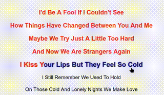

# A small program demo *karaoke effects*

> [!WARNING]
> This program in progressing, keep your expectations low.



---

## Key features
- **Read-time Lyrics Highlightings**
- **Interactive Lyrics**

---

## Core functionality
```javascript
        const currentTime = audio.currentTime;
        lyrics.forEach((word, index) => {
            const wordTime = parseFloat(word.getAttribute("data-time"));
            const nextWordTime = index < lyrics.length - 1
                ? parseFloat(lyrics[index + 1].getAttribute("data-time"))
                : audio.duration;
            const duration = nextWordTime - wordTime;

            if (currentTime >= wordTime && currentTime < nextWordTime) {
                word.classList.add('word');
                word.style.setProperty('--animation-duration', `${duration}s`);

                if (audio.paused) {
                    word.style.setProperty('animation-delay', `${duration}s`);
                    word.style.setProperty('--animation-play-state', 'paused');
                } else {
                    word.style.setProperty('--animation-play-state', 'running');
                }

            } else if (currentTime > wordTime) {
                word.classList.remove('text-black');
                word.classList.add('text-red');
                word.classList.remove('word');
            } else {
                word.classList.add('text-black');
                word.classList.remove('text-red');
                word.classList.remove('word');
            }
        });
```

